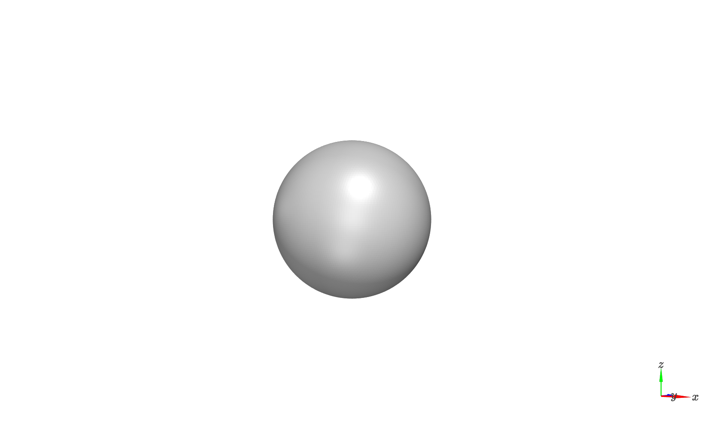
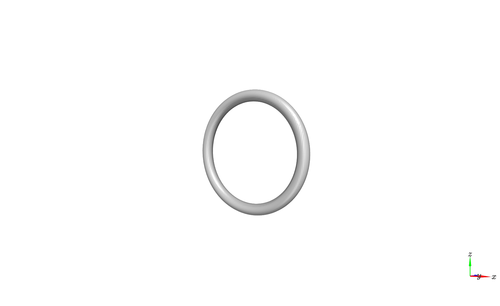
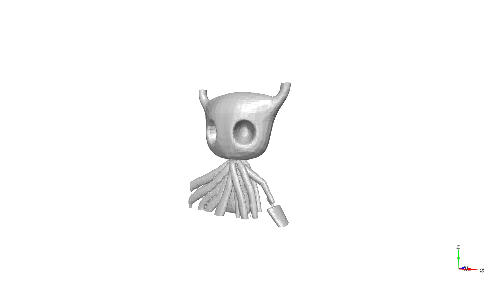

# Machine Learning for 3D Geometry

## Outline
- ### Surface Representation and Alignment
- ### Shape Classification and Segmentation
- ### 3D Shape Reconstruction
- ### References
---
## Surface Representation and Alignment
### Signed Distance Fields
Given a point calculate the SDF function for:
- sphere
- torus
- atom: combines sphere and torus SDF function
- SDF grids: build an SDF grid that shows the implicit representation in a cube of size 1x1x1
- Visualization of `.ply` objects in `MeshLab`
### Conversion from SDF Grids to Occupancy Grids
### Conversion From SDF to Triangle Meshes
- Marching Cubes

Sphere            |  Torus
:-------------------------:|:-------------------------:
 | 

Atom            |  MLP
:-------------------------:|:-------------------------:
 | 

- Vertex Interpolation
- Export triangle meshes as `Wavefront OJB`
### Conversion from Triangle Meshes to Point Clouds
- Sample n points using barycentric coordinates for each triangle
- Export point cloud as `Wavefront OBJ`
### Rigid Shape Alignment with Procrustes
- align two shapes given near-perfect point correspondences using procrustes

---
## Shape Classification and Segmentation
---
## 3D Shape Reconstruction
---
## References

[1] Park, Jeong Joon, et al. "Deepsdf: Learning continuous signed distance functions for shape representation." Proceedings of the IEEE/CVF Conference on Computer Vision and Pattern Recognition. 2019

[2] Mescheder, Lars, et al. "Occupancy networks: Learning 3d reconstruction in function space." Proceedings of the IEEE/CVF Conference on Computer Vision and Pattern Recognition. 2019.

[3] Lorensen, William E., and Harvey E. Cline. "Marching cubes: A high resolution 3D surface construction algorithm." ACM siggraph computer graphics 21.4 (1987): 163-169.

[4] Schönemann, Peter H. "A generalized solution of the orthogonal procrustes problem." Psychometrika 31.1 (1966): 1-10.